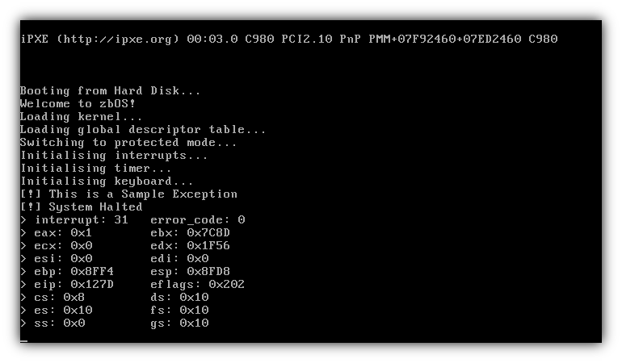

# zbOS

zbOS is a hobby operating system being built from scratch. zbOS is intended to be a UNIX clone.

### What's been done:

- [x] A custom bootloader capable of switching to protected mode and bootstrapping a kernel
- [ ] \(wip) a standard C library implementation (libc)
- [x] Interrupt handler
- [ ] Device drivers
  - [x] video (hardware cursor, scrolling, ASCII escapes)
  - [ ] \(wip) keyboard
  - [ ] filesystem (SFS?)
- [ ] Memory management (paging, heap)
- [ ] Process scheduling (multitasking)
- [ ] the future (userland?)

### Getting started

    apt install build-essential nasm qemu       # on debian
    dnf install @development-tools nasm qemu    # on fedora

    make run                                    # build and run in qemu
    make debug                                  # run with bochs debugger

### Resources:

- [OSDev.org](http://wiki.osdev.org) :point_left: this is all you need
- [Bran's Kernel Development](http://www.osdever.net/bkerndev/index.php)
- [JamesM's kernel development tutorial](http://www.jamesmolloy.co.uk/tutorial_html/)
- [linux-insides](https://github.com/0xAX/linux-insides)

